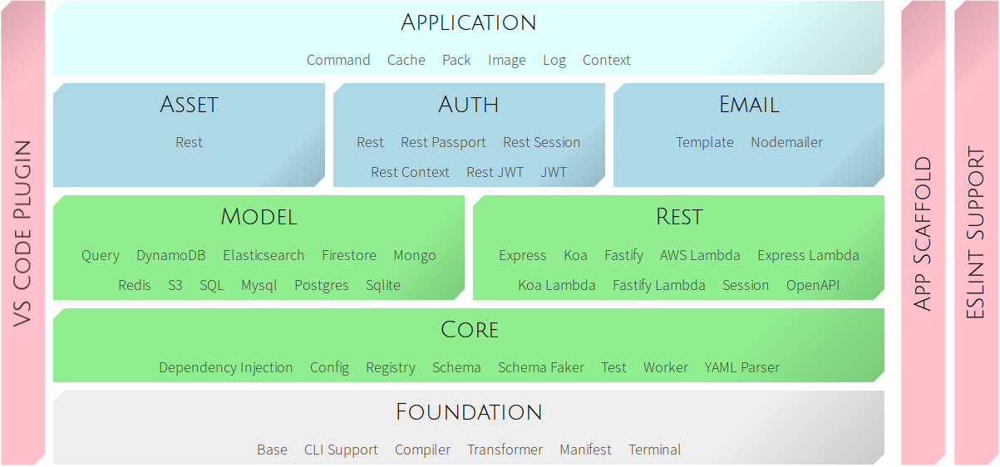

<!-- This file was generated by @travetto/doc and should not be modified directly -->
<!-- Please modify https://github.com/travetto/travetto/tree/main/related/overview/doc.ts and execute "npx trv doc" to rebuild -->

<h1>   
  
  The Travetto Framework
</h1>

The goal of the framework is to provide a holistic application platform with the a focus on interactive development.

## Philosophy
The framework relies up five key principles:
   
   *  **Typescript as a development platform.**  This means the framework is intimately tied to [Typescript](https://typescriptlang.org) and it's compiler.
   *  **Code over configuration.** This means that the framework prefers meta-programming via decorators over configuration.  Code is always the best place to define configuration.
   *  **Do not ask the developer to repeat information.** Specifically, source code transformation (and analysis) is a key element of providing seamless functionality while requiring as little as possible from the person using the framework.
   *  **Strive for a minimal footprint.** When libraries are considered, an overarching goal is to keep the size and quantity of dependencies and functionality to a minimum.  The net result should be as little code as possible, and as few dependencies as possible.
   *  **Development responsiveness is paramount.** The framework should aim for instant feedback when possible to minimize the time between making a change and seeing it.

## Modules
Every module within the framework follows the overarching philosophy.  For the most part each module is as isolated as possible.  The modules are stacked vertically to generally indicate dependencies.  The only exception is for common libraries, which are unrelated.

