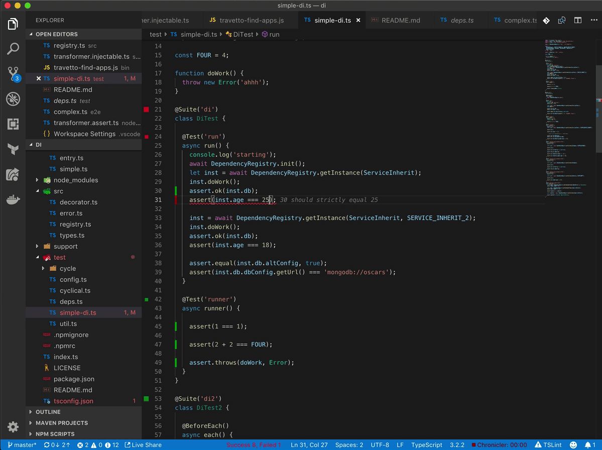
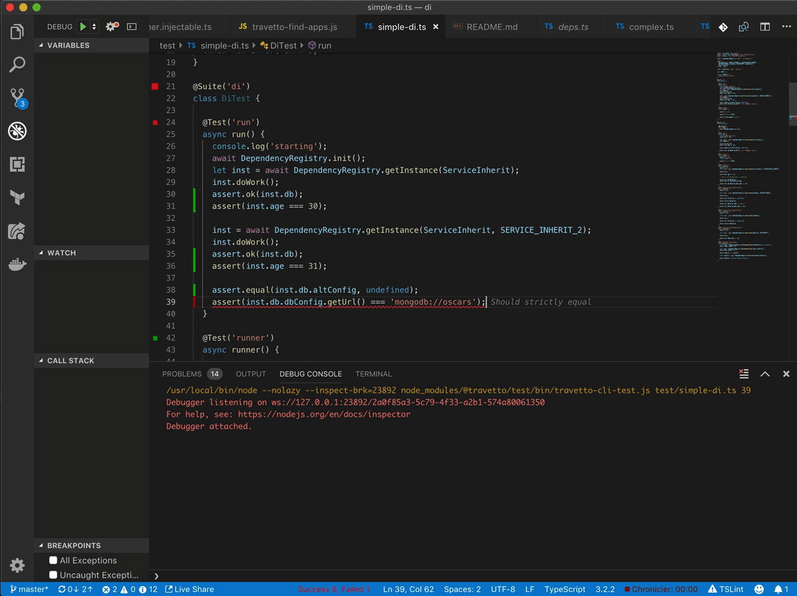
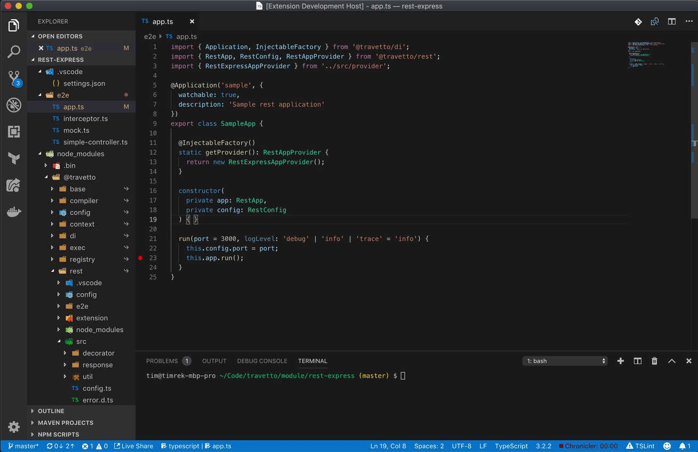
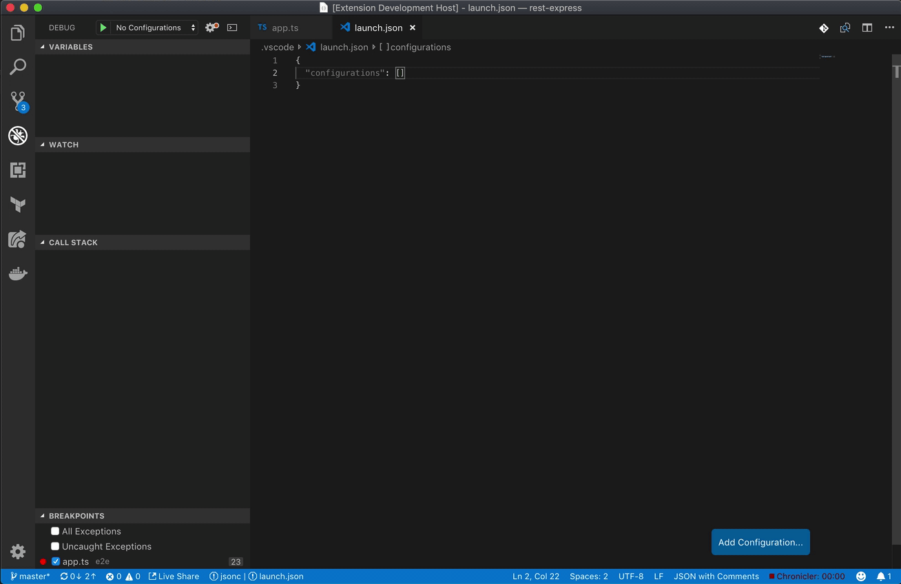

# VS Code Plugin

The [`plugin`](https://marketplace.visualstudio.com/items?itemName=arcsine.travetto-plugin) directly integrates with [Travetto framework](https://travettio.io), exposing the [`cli`](https://github.com/travetto/travetto/tree/master/module/cli) functionality.

The currently supported features are:
* Real-time test evaluation and debugging
* Application launching with parameters
* Miscellaneous utilities

## Testing

The test related functionality relies upon the [`test`](https://github.com/travetto/travetto/tree/master/module/test) module being installed, and used to define tests (`@Suite` and `@Test`).

### Real-time test evaluation.

The real-time test functionality will re-evaluate your test code on save.  This means as you type and save, the test will run.  The test will provide feedback inline, using green to indicate success, red to indicate failure, and gray to indicate unknown.

#### Supported commands 

`Travetto: Re-Run tests` to force a full re-run of all the tests in a given document
  
### Debugging tests

While working on a test, if you want to debug it, you can press running `command-shift-t` on OSX or `ctrl-shift-t` on win/linux.  This will start a debug session with the current 
line activated as a breakpoint.  This allows you to seamlessly jump into a debug session while writing tests.

#### Supported commands

`Travetto: Debug tests` to force a running all the tests in debug mode.  Will not establish a breakpoint, but will use any existing breakpoints.

## Application launching

While using the [`di`](https://github.com/travetto/travetto/tree/master/module/di), a common pattern is to use `@Application` annotations to define entry points into the application.  These entry points can take parameters, and if using the cli, you can invoke them with parameters, type checked and validated.

The plugin exposes this functionality as a command, to allow you to debug these applications directly from vscode.  

### Running

Launching relies upon the command `Travetto: Run New Application`.  This will show you a list of the available entry points in the application, with the parameters they support.  Selecting an application will take you through the parameter flow to select inputs, and once all parameters are selected, your application will launch.  

After running and selecting a configuration for an application, you can now access those configurations via `Travetto: Run Recent Application`.  This allows you to execute a recent run that you can invoke immediately without prompting for inputs. If you find yourself running the same application multiple times, you can also invoke `Travetto: Run Most Recent Application` to bypass application selection overall.

### Exporting and Customizing

If at any point in time, you wish to modify the launch configuration of any application, you can execute the command `Travetto: Export Application Launch`, and it will provide the same options as launch.  The only difference is that instead of running the application when it's done, you will have a new launch config in your debug launch configs.  This option is now completely independent from the plugin and can be modified without issue.

#### Commands

`Travetto: Run New Application` to launch a new application config
`Travetto: Run Recent Application` to launch a previously configured application
`Travetto: Run Most Recent Application` to launch the most recently run configured application
`Travetto: Export Application Launch` to export an application config

## Misc Utilities

Currently the supported commands are:

`Travetto: Clean` to run the cli operation `travetto clean`.  This will purge the project's cache, which is generally useful for things like npm installs.
<!-- Image of clean -->

# Requirements

* You should have the [`Travetto framework`](https://travetto.io) installed, version 0.5.0 and higher. 
* Tests require the [`test`](https://github.com/travetto/travetto/tree/master/module/test) module to be installed.
* Application running requires the [`di`](https://github.com/travetto/travetto/tree/master/module/di) module to be installed.

# Known Issues

Calling out known issues can help limit users opening duplicate issues against your extension.

# Release Notes

## 0.5.x

* Introduced application launching
* Resolved test stability issues
* Introduced clean functionality

